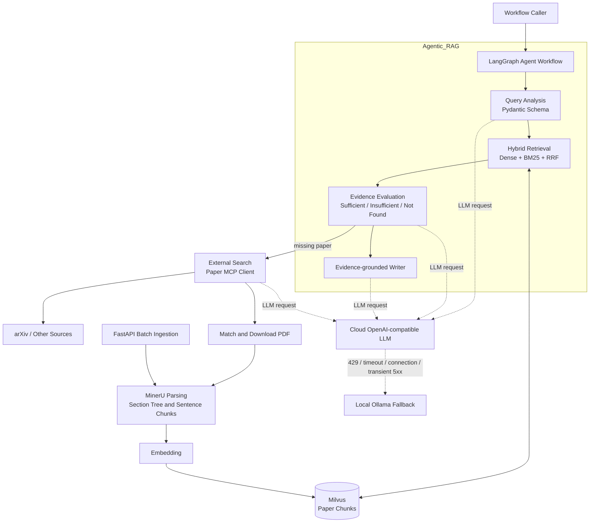
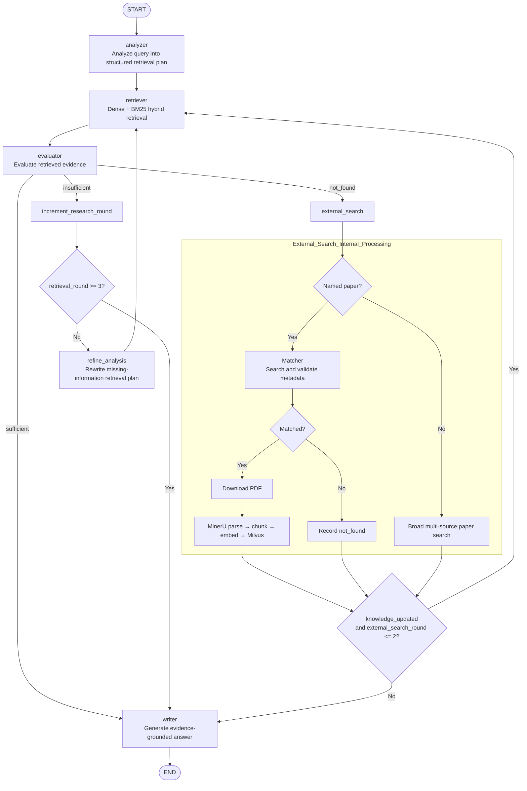

# 面向 3D 视觉科研的 Agentic RAG 智能分析系统

## 技术栈

概述：LlamaIndex | LangGraph | Agentic RAG | Milvus | MCP | MinerU | FastAPI | Ollama | RAGAS | PEFT/LoRA

详细信息：

| 类别 | 技术 | 版本 | 用途 |
|---|---|---|---|
| Agent / RAG 框架 | LlamaIndex | 0.14.23 | Prompt、结构化输出、Embedding 与 RAG 组件 |
| 工作流编排 | LangGraph | 1.2.7 | 基于 StateGraph 编排 Analyzer、Retriever、Evaluator、外部检索与 Writer |
| 数据模型与配置 | Pydantic<br>pydantic-settings | 2.13.4<br>2.14.2 | 约束 LLM 结构化输出，管理状态与环境配置 |
| 混合检索 | Milvus<br>pymilvus | 服务端可配置<br>2.6.17 | Dense + BM25 混合召回、元数据过滤与 RRF 融合排序 |
| Embedding | Qwen3-Embedding-8B | 模型版本可配置 | 论文知识块向量化、查询向量化及 LoRA 微调 |
| 云端推理 | OpenAI 兼容接口<br>DeepSeek-V4-Flash | 接口可配置<br>模型版本可配置 | Analyzer、Evaluator、Matcher 与 Writer 的默认推理服务 |
| 本地推理 | Ollama<br>Qwen3.6-27B | 0.6+<br>模型版本可配置 | 云端发生 429、超时、连接失败或可恢复 5xx 时自动降级 |
| 文献检索与下载 | Paper Search MCP<br>arXiv<br>Zotero<br>WebDAV | 未固定<br>4.0.0<br>1.13.2<br>3.14.7 | 论文搜索、元数据匹配、PDF 下载与附件同步 |
| PDF 解析 | MinerU<br>PyMuPDF | 3.4.2<br>1.27.2.2 | 版面分析、OCR、Markdown/JSON 输出与朴素文本提取 |
| 向量入库服务 | FastAPI<br>Uvicorn | 0.139.0<br>0.50.2 | 提供批量 PDF 解析、分块、Embedding 与 Milvus 入库接口 |
| RAG 评测 | RAGAS | 0.3+ | 构建单论文、多论文和开放式问答评测数据 |
| Embedding 微调 | PEFT<br>LoRA<br>InfoNCE | 0.17+<br>—<br>— | 构造 Hard Negative，训练 Adapter，并计算 Recall@K 与 MRR |
| 交互界面 | Chainlit | 2.11.1 | 对话界面与执行步骤展示；当前仍需接入最新 LangGraph 工作流 |
| 测试 | Pytest<br>pytest-asyncio | 8+<br>0.24+ | 路由、fallback、统计、数据构造与评测指标测试 |

---

## GS-Agent Framework



## LangGraph Workflow



## 可复现开发流程

创建虚拟环境，并安装运行与测试依赖：

```bash
python3 -m venv .venv
source .venv/bin/activate
python -m pip install -r requirement-dev.txt
cp .env.example .env
```

运行 GS-Agent 测试集

```bash
python -m pytest
```

### 云端到本地的 LLM 的 auto fallback

将 `GLOBLE_LOCAL_OPTIONAL` 设置为 `true`，并在
`config/settings.py` 中配置 `Local_Model`。工作流会优先调用云端
OpenAI 兼容接口；遇到 HTTP 429、请求超时、连接失败或可恢复的 5xx
错误时，自动切换到本地 Ollama 模型重试。无效请求和结构化输出错误
不会触发降级，避免掩盖真实的业务问题。

### 核验论文与知识块数量

确保 Milvus 正常运行后执行：

```bash
python -m tools.milvus_stats --json
```

统计报告会分别给出已解析论文目录数、Milvus 中去重后的 `paper_id`
数量，以及实体/知识块总数。简历、README 或实验报告引用知识库规模时，
应将该 JSON 结果与实验产物一同保存，保证数据可追溯。

### Qwen Embedding 的 LoRA 与 InfoNCE 微调

首先从原始 Milvus 索引的 Top-K 召回结果中挖掘 Hard Negative：

```bash
python -m tools.embedding_finetune.mine_hard_negatives \
  --dataset GS_RAGAS_DATASET/questions.jsonl \
  --output artifacts/embedding/mined_negatives.jsonl \
  --top-k 20
```

随后将 Top-K Hard Negative 与跨论文混淆负样本、随机负样本组合，
构建训练数据：

```bash
python -m tools.embedding_finetune.dataset \
  --dataset GS_RAGAS_DATASET/questions.jsonl \
  --mined-negatives artifacts/embedding/mined_negatives.jsonl \
  --output artifacts/embedding/train.jsonl \
  --negatives-per-query 4
```

先记录基础模型指标，再使用 InfoNCE Loss 训练 LoRA Adapter，最后在相同的
独立测试集上评测微调模型：

```bash
python -m tools.embedding_finetune.evaluate \
  --data artifacts/embedding/train.jsonl \
  --model Qwen/Qwen3-Embedding-8B \
  --output artifacts/embedding/baseline_metrics.json

python -m tools.embedding_finetune.train \
  --data artifacts/embedding/train.jsonl \
  --model Qwen/Qwen3-Embedding-8B \
  --output artifacts/embedding/qwen3-lora

python -m tools.embedding_finetune.evaluate \
  --data artifacts/embedding/train.jsonl \
  --model Qwen/Qwen3-Embedding-8B \
  --adapter artifacts/embedding/qwen3-lora \
  --output artifacts/embedding/finetuned_metrics.json
```

只有当微调后的指标文件在独立测试集上显示 Recall@K、MRR 得到提升时，
才能得出检索效果改善的结论。确定最终 Adapter 后，还需要使用微调模型
重新生成论文向量并重建 Milvus Collection，之后才能对比实际环境中的
Top-K 检索结果。
